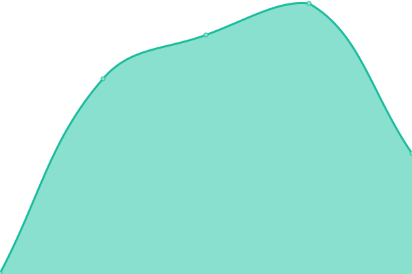

# [📈 Live Status](https://demo.upptime.js.org): <!--live status--> **🟧 Partial outage**

This repository contains the open-source uptime monitor and status page for [sw-status-poc](https://demo.upptime.js.org), powered by [Upptime](https://github.com/upptime/upptime).

With [Upptime](https://upptime.js.org), you can get your own unlimited and free uptime monitor and status page, powered entirely by a GitHub repository. We use [Issues](https://github.com/sw-status-poc/status/issues) as incident reports, [Actions](https://github.com/sw-status-poc/status/actions) as uptime monitors, and [Pages](https://demo.upptime.js.org) for the status page.

<!--start: status pages-->
<!-- This summary is generated by Upptime (https://github.com/upptime/upptime) -->
<!-- Do not edit this manually, your changes will be overwritten -->
<!-- prettier-ignore -->
| URL | Status | History | Response Time | Uptime |
| --- | ------ | ------- | ------------- | ------ |
|  [Shipwire](https://www.shipwire.com) | 🟩 Up | [shipwire.yml](https://github.com/sw-status-poc/status/commits/HEAD/history/shipwire.yml) | 

 707ms
     
 | 

<a href="https://sw-status-poc.github.io/status/history/shipwire">100.00%</a>
    

|  [Merchant](https://merchant.shipwire.com) | 🟩 Up | [merchant.yml](https://github.com/sw-status-poc/status/commits/HEAD/history/merchant.yml) | 

 428ms
     
 | 

<a href="https://sw-status-poc.github.io/status/history/merchant">100.00%</a>
    

|  [Admiral](https://admiral.shipwire.com) | 🟩 Up | [admiral.yml](https://github.com/sw-status-poc/status/commits/HEAD/history/admiral.yml) | 

 606ms
     
 | 

<a href="https://sw-status-poc.github.io/status/history/admiral">100.00%</a>
    

|  [Admiral failing](https://merchant.cnct.alpha.dev.gcp.shipwire.com/) | 🟥 Down | [admiral-failing.yml](https://github.com/sw-status-poc/status/commits/HEAD/history/admiral-failing.yml) | 

 317ms
     
 | 

<a href="https://sw-status-poc.github.io/status/history/admiral-failing">0.01%</a>
    

<!--end: status pages-->

[**Visit our status website →**](https://demo.upptime.js.org)

## 📄 License

- Powered by: [Upptime](https://github.com/upptime/upptime)
- Code: [MIT](./LICENSE) © [Anand Chowdhary](https://anandchowdhary.com), supported by [Pabio](https://pabio.com)
- Data in the `./history` directory: [Open Database License](https://opendatacommons.org/licenses/odbl/1-0/)
